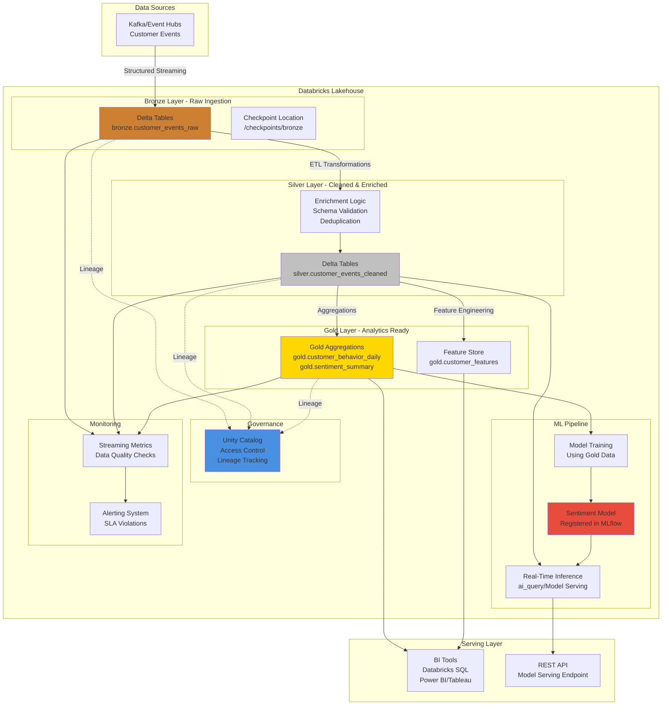

# Databricks Lakehouse Architecture - Real-Time Customer Behavior Analytics

## Overview

This project implements an end-to-end Databricks Lakehouse solution for real-time customer behavior analytics with sentiment scoring. The architecture follows the medallion pattern (Bronze → Silver → Gold) with integrated AI/ML inference, governance, and monitoring.

## Architecture Diagram

## Data Flow

### 1. Real-Time Ingestion (Bronze)
- **Source**: Kafka/Event Hubs/Kinesis
- **Format**: JSON events (customer interactions, reviews, clicks)
- **Destination**: `bronze.customer_events_raw` (Delta table)
- **Features**: Schema enforcement, checkpointing, fault tolerance

### 2. Data Transformation (Silver)
- **Input**: Bronze raw data
- **Processing**:
  - Schema validation and type conversion
  - Deduplication based on event_id
  - Data quality checks (null handling, range validation)
  - Enrichment (customer demographics, product info)
- **Destination**: `silver.customer_events_cleaned`

### 3. Analytics Aggregation (Gold)
- **Input**: Silver cleaned data
- **Outputs**:
  - `gold.customer_behavior_daily`: Daily aggregations per customer
  - `gold.sentiment_summary`: Sentiment scores aggregated by time period
  - `gold.customer_features`: ML-ready feature sets

### 4. ML Pipeline
- **Training**: Uses Gold aggregated data to train sentiment classification model
- **Inference**: Real-time scoring of incoming Silver events using `ai_query` or Model Serving
- **Model Registry**: MLflow for versioning and deployment

### 5. Governance (Unity Catalog)
- **Catalog Structure**: `lakehouse.bronze.*`, `lakehouse.silver.*`, `lakehouse.gold.*`
- **Access Control**: Role-based permissions per layer
- **Lineage**: Automatic tracking of data transformations

### 6. Monitoring & Alerting
- **Streaming Metrics**: Lag, throughput, error rates
- **Data Quality**: Schema violations, null rates, anomaly detection
- **ML Metrics**: Model drift, prediction latency, accuracy

## Technology Stack

- **Compute**: Databricks Runtime (Spark 3.5+)
- **Storage**: Delta Lake on S3/ADLS/GCS
- **Streaming**: Structured Streaming (Kafka connector)
- **ML**: MLflow, Databricks Model Serving, ai_query
- **Governance**: Unity Catalog
- **Orchestration**: Delta Live Tables / Databricks Workflows
- **Monitoring**: Databricks SQL + Custom metrics

## Key Design Decisions

1. **Medallion Architecture**: Ensures data quality improves at each layer
2. **Delta Lake**: ACID transactions, time travel, schema evolution
3. **Structured Streaming**: Exactly-once processing guarantees
4. **Unity Catalog**: Centralized governance across all layers
5. **Real-Time Inference**: Low-latency scoring for immediate insights
